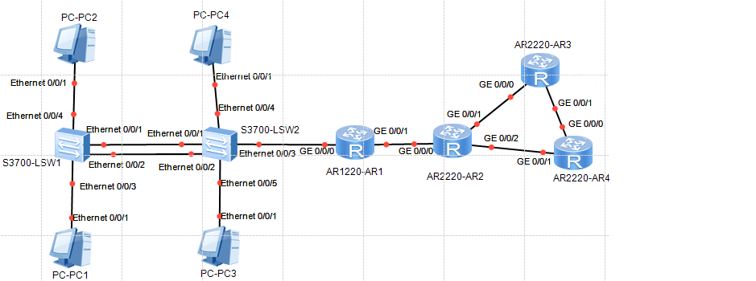

# 学习华为 eNSP 仿真软件

节选自《数据通信技术》期末课程考核方案，直接做到 `《数据通信技术》课程考核方案.doc` 里面，就像课业一样完成即可，划删除线的无需完成。

eNSP 下载地址：https://pan.baidu.com/s/1YCQjb42WsiQT1p8NY2_neg

提取码：king

## 考核目的

本次考核旨在考查学生对局域网相关网络技术掌握情况,包括对路由器和交换机基本配置、STP 协议的配置、DHCP 的配置、VLAN 的划分、VLAN 间路由的实现、静态路由、动态路由协议的配置等相关知识。

## 考核形式

1. 利用模拟器 eNSP，按定的拓扑图连接设备。  
   依据命名规则修改路由器和交换机名字，然后按照考核要求进行基本参数配置。  
   路由器命名格式如下：本人的姓名拼音第一个字母大写-R 编号，如张三，则命名为 `ZS-R1`,`ZS-R2`,`ZS-R3`，`ZS-R4`。  
   交换机命名如下：`ZS-SW1`，`ZS-SW2`，`ZS-SW3`。

2. 考核报告须提交电子版文档 1 份，要求电子文档命名方式为“`学号+姓名.doc`”。  
   配置过程需要截图附在每一考核点后面。  
   用 eNSP 模拟软件所做的拓扑和设备配置文件需要保存，与考核报告打包一起提交。  
   总的压缩包以“`学号+姓名`”命名。

## 考核内容

网络综合配置

### 项目说明

1. 项目背景：
   某企业网络通过内部路由器、交换机互联起来，整个网络的拓扑如图 1 所示。

   

2. 各设备的 IP 地址配置如下。

| AR1      |                                   |
| -------- | --------------------------------- |
| G0/0/0.1 | `192.168.(学号末尾两位+1).254/24` |
| G0/0/0.2 | `192.168.(学号末尾两位+2).254/24` |
| G0/0/1   | `12.1.学号末尾两位.1/24`          |

| AR2    |                          |
| ------ | ------------------------ |
| G0/0/0 | `12.1.学号末尾两位.2/24` |
| G0/0/1 | `23.1.学号末尾两位.2/24` |
| G0/0/2 | `24.1.学号末尾两位.2/24` |

| AR3    |                           |
| ------ | ------------------------- |
| G0/0/0 | `23.1.学号末尾两位.3/24`  |
| G0/0/1 | `34.1.学号末尾两位.3/24`  |
| G0/0/2 | `218.1.学号末尾两位.1/24` |

| AR4    |                          |
| ------ | ------------------------ |
| G0/0/0 | `34.1.学号末尾两位.4/24` |
| G0/0/1 | `24.1.学号末尾两位.4/24` |

PC1、PC2、PC3、PC4 的 IP 地址均通过 R1 上的 DHCP 自动获取(DHCP 需要配置)。

PC1 和 PC3 属于 VLAN2，VLAN2 所在的 IP 子网是 `192.168.(学号末尾两位+1).0/24`。

PC2 和 PC4 属于 VLAN3，VLAN3 所在的 IP 子网是 `192.168.(学号末尾两位+2).0/24`。

### 项目要求及评分标准

1. VLAN 配置:  
   在 SW1 和 SW2 上配置 VLAN，使 PC1 与 PC3 属于 `VLAN 2`, PC2 与 PC4 属于 `VLAN 3`。  
   查看各交换机接口 VLAN 的配置信息。（20 分）

2. VLAN 间互联:  
   通过配置 `单臂路由`，实现 VLAN 间电脑可以相互访问。  
   待第三步 DHCP 配置完成，各 PC 获取 IP 后，测试两台终端 PC-1 与 PC-2 间的连通性（20 分）

3. 配置 DHCP。  
   基于 `全局地址池` 的方式在路由 R1 上配置 DHCP，使 4 台 PC 机都可以获取到正确的 IP 地址、网关和 DNS，DNS 服务器的地址是 `218.1.学号末尾两位.3/24`。  
   查看各 PC 机的 IP 地址信息。（20 分）

4. 配置 STP 协议。  
   配置 `生成树协议`，使 SW2 为所有 VLAN 的根交换机。  
   查看交换机 SW2 的 STP 信息。（20 分）

5. 静态路由配置:  
   配置 R1 与 R2 之间互连的默认 `静态路由`，测试 PC1 和路由器 R2 的连通性。（10 分）

6. 配置动态路由协议:  
   配置 R2、R3 和 R4 运行 `OSPF 路由协议`。  
   配置完成后，测试四台路由器之间相连通性。（10 分）
